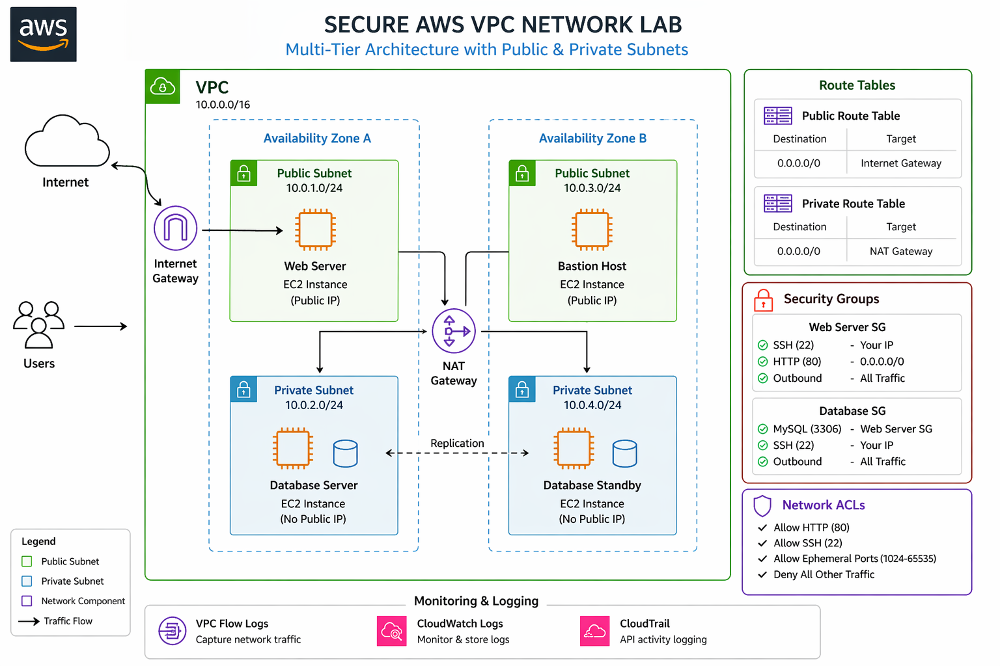
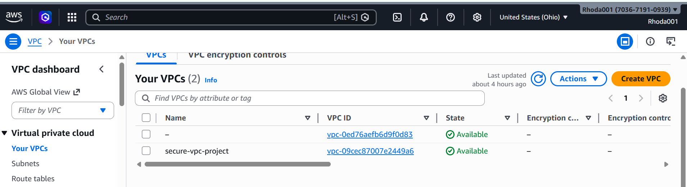
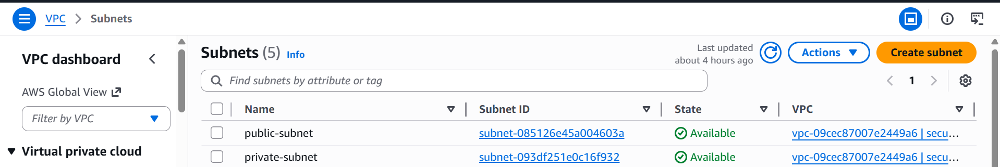
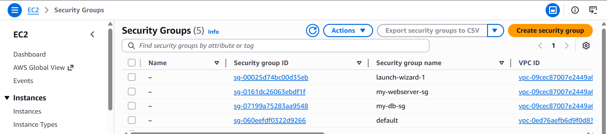
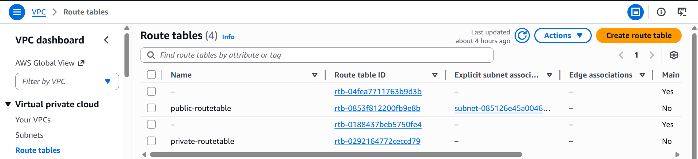
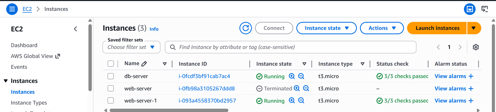

# 🔐 Secure AWS VPC Network Lab

## 📌 Overview
This project demonstrates the design and implementation of a secure multi-tier AWS network architecture using VPC, public and private subnets, routing, and firewall configurations.

It also includes real-world troubleshooting scenarios simulating common network and security misconfigurations.

---

## 🎯 Objectives
- Design secure network architecture using AWS VPC
- Implement subnet segmentation (public vs private)
- Configure firewall controls using Security Groups and NACLs
- Perform real-world troubleshooting (Break & Fix scenarios)

---

## 🏗️ Architecture

---

## 🧰 AWS Services Used
- VPC
- EC2
- Security Groups
- Network ACLs (NACLs)
- Internet Gateway
- NAT Gateway
- CloudWatch (optional)
- VPC Flow Logs (optional)

---

## 🔐 Security Design
- Public subnet for web server (internet-facing)
- Private subnet for database (no public access)
- Least privilege access using Security Groups
- Controlled traffic using route tables and NAT Gateway

---

## 🧪 Troubleshooting Lab (Break & Fix)

This project includes simulated failures to demonstrate troubleshooting skills:

| Scenario | Issue | Fix |
|--------|------|-----|
| HTTP blocked | Website not loading | Restore port 80 in Security Group |
| Missing route | No internet access | Add route to Internet Gateway |
| DB access failure | App cannot connect | Fix DB Security Group |

👉 See full details: [Troubleshooting Guide](troubleshooting/break-and-fix.md)

---

## 📸 Screenshots

---

## 🧠 Key Learnings
- AWS networking fundamentals (TCP/IP, routing)
- Firewall configuration (Security Groups, NACLs)
- Secure cloud architecture design
- Real-world troubleshooting techniques

---

## 🚀 Future Improvements
- Infrastructure as Code (Terraform)
- CI/CD pipeline integration
- SIEM-based monitoring and alerting

---

## 👨‍💻 Author
Rhoda Ndege
